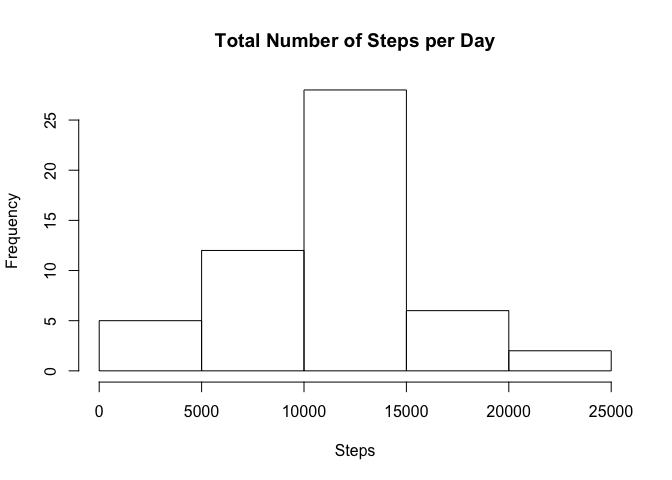
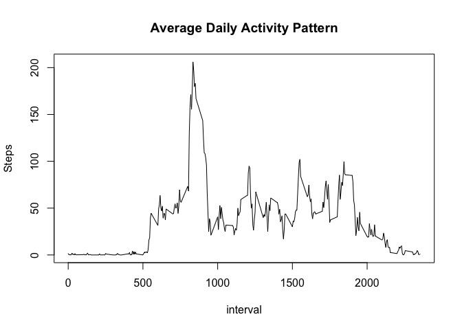
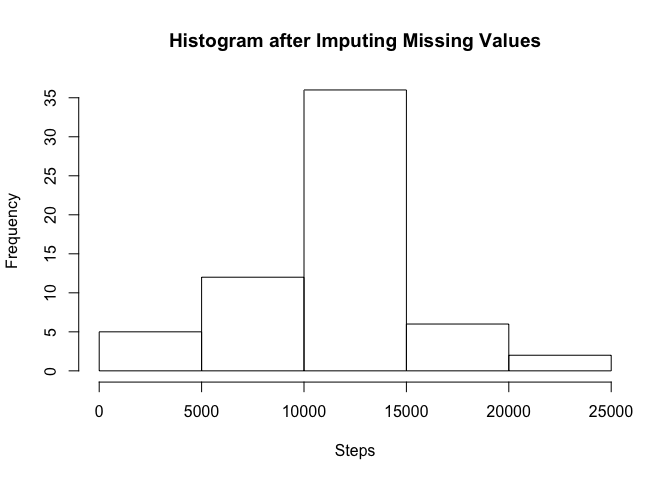
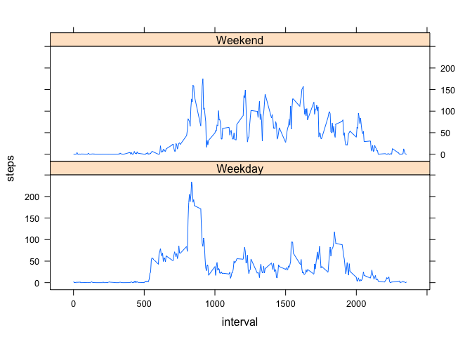

# Reproducible Research: Peer Assessment 1


## Loading and preprocessing the data
Assumes current working directory is where the unzipped file "activity.csv" is located:

```r
activity<-read.csv("activity.csv")
activity$date <- as.Date(activity$date)
```

## What is mean total number of steps taken per day?

```r
activity_per_day <- aggregate(steps ~ date, activity, sum, na.rm=T)
hist(activity_per_day$steps, xlab="Steps", main="Total Number of Steps per Day")
```

 

Mean and median of total steps per day:

```r
mean(activity_per_day$steps)
```

```
## [1] 10766.19
```

```r
median(activity_per_day$steps)
```

```
## [1] 10765
```

## What is the average daily activity pattern?

```r
average_per_interval <- aggregate(steps ~ interval, activity, mean)
plot(average_per_interval, type="l", ylab="Steps", main="Average Daily Activity Pattern")
```

 

Interval with the maximum average number of steps per day:

```r
average_per_interval$interval[which.max(average_per_interval$steps)]
```

```
## [1] 835
```

## Imputing missing values
Number of cases with missing values before imputation:

```r
nrow(activity)-sum(complete.cases(activity))
```

```
## [1] 2304
```

Imputation strategy: replace missing values with average for that interval.

```r
imputed_activity <- activity
imputed_activity$steps <- sapply(1:nrow(activity),
                                 FUN = function(x)
                                     if (is.na(activity$steps[x]))
                                         average_per_interval$steps[average_per_interval$interval == activity$interval[x]]
                                     else
                                         activity$steps[x])
```

Number of cases with missing values after imputation:

```r
nrow(imputed_activity)-sum(complete.cases(imputed_activity))
```

```
## [1] 0
```

Histogram of total number of steps per day after imputation of missing data: 

```r
imputed_activity_per_day <- aggregate(steps ~ date, imputed_activity, sum)
hist(imputed_activity_per_day$steps,
     main="Histogram after Imputing Missing Values",
     xlab="Steps")
```

 

Mean and median of total number of steps per day after imputation of missing data:

```r
mean(imputed_activity_per_day$steps)
```

```
## [1] 10766.19
```

```r
median(imputed_activity_per_day$steps)
```

```
## [1] 10766.19
```

## Are there differences in activity patterns between weekdays and weekends?
Add factor with type of day (Weekend or Weekday) based on date:

```r
activity$type_of_day <- factor(sapply(activity$date, FUN = function(x) if (weekdays(x) == "Sunday" | weekdays(x) == "Saturday") "Weekend" else "Weekday"))
```

Plot activity pattern comparing weekdays and weekends:

```r
average_activity <- aggregate(steps ~ interval+type_of_day, activity, mean)
library(lattice)
xyplot(steps~interval|type_of_day,
       average_activity,
       layout=c(1,2),
       type="l")
```

 
